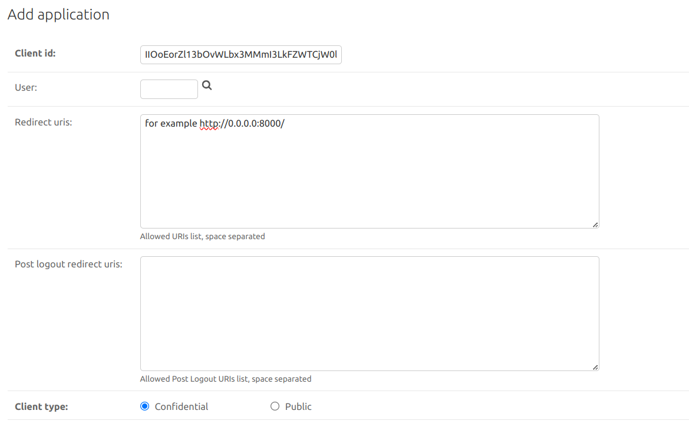
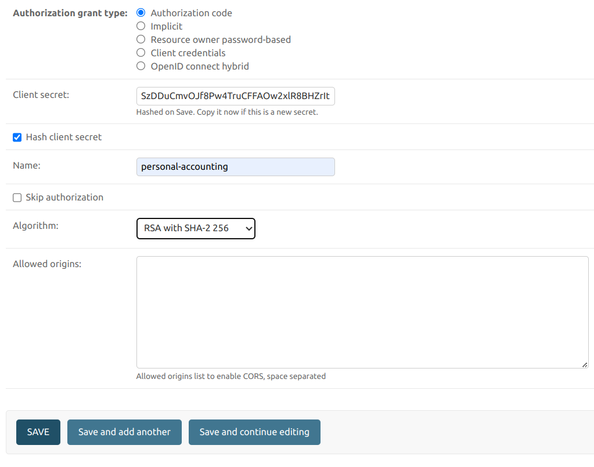

## Personal Accounting

### Setup

For setup you need docker and docker compose installed.  
Create .env file in source directory using env.example as template.  
You will need ports 6379, 5432 and 8000 available. You will also need to create env.django file in root directory.
Use env.django.example as a template.

### Run  

To run project you can use make commands, here is list of them:

- make build-app - build docker image and run containers
- make up - start containers
- make stop - stop containers
- make restart - restart containers
- make logs - backend container logs 
- make manage - command that allows you to execute manage.py commands inside the backend container

When containers are running, you will need to create superuser. Use following command:  

- make manage createsuperuser  

and provide needed information. Then you will need to create application for JWT tokens. Go to 
http://0.0.0.0:8000/admin/oauth2_provider/application/add/ and fill form as shown below:

**IMPORTANT:** Don't forget to change redirect uri, and don't change client id and client secret (django will 
generate it automatically)!
  

Now you can use Postman to work with API.
